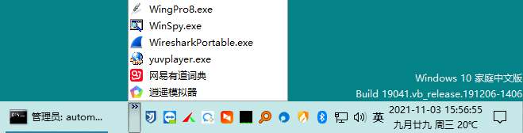
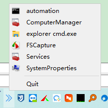

# AppQuickLauncher
AppQuickLauncher is a tool that can quickly launch apps by clicking the app tray icon.

On Windows 7 or Windows 10, we can add a folder that contains app shortcuts to task bar, see



But on Windows 11, that can't work anymore.

So I wrote a tool using PyQt5 that does the same thing, when clicking the app tray, it shows a list of apps.



Modify the config file, it's json format. Add a new app info and restart AppQuickLauncher.pyw
```json
{
    "appList": [{
            "name": "&automation",
            "exe": "C:/Windows/System32/cmd.exe",
            "argv": "",
            "dir": "d:/Codes/Python/automation",
            "icon": 0
        },
        {
            "name": "&ComputerManager",
            "exe": "C:/Windows/System32/mmc.exe",
            "argv": "compmgmt.msc"
        },
        {
            "name": "&explorer cmd.exe",
            "exe": "C:/Windows/explorer.exe",
            "argv": "/select, C:\\Windows\\System32\\cmd.exe"
        },
        {
            "name": "&FSCapture",
            "exe": "D:/Program Files/FastStoneCapture/FSCapture.exe"
        },
        {
            "name": "&Services",
            "exe": "C:/Windows/System32/mmc.exe",
            "argv": "services.msc"
        },
        {
            "name": "&SystemProperties",
            "exe": "C:/Windows/System32/SystemPropertiesAdvanced.exe"
        }
    ]
}
```

